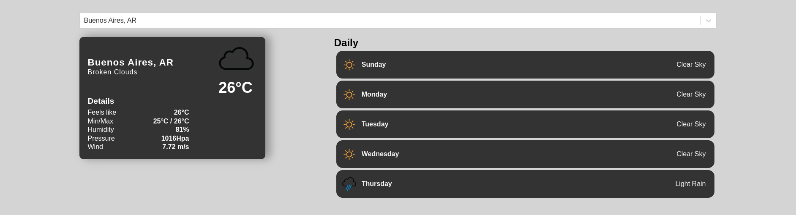

# Weather App

This is a simple weather app that uses the OpenWeatherMap API to get the weather data. It is built using React

The app is hosted in netlify and can be accessed [here](https://dp-react-weather.netlify.app)
